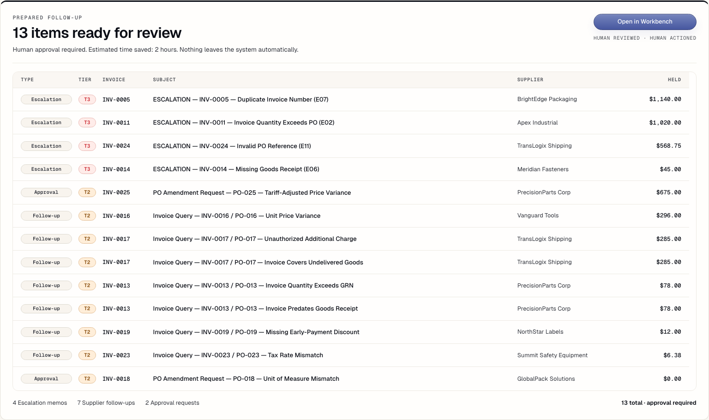
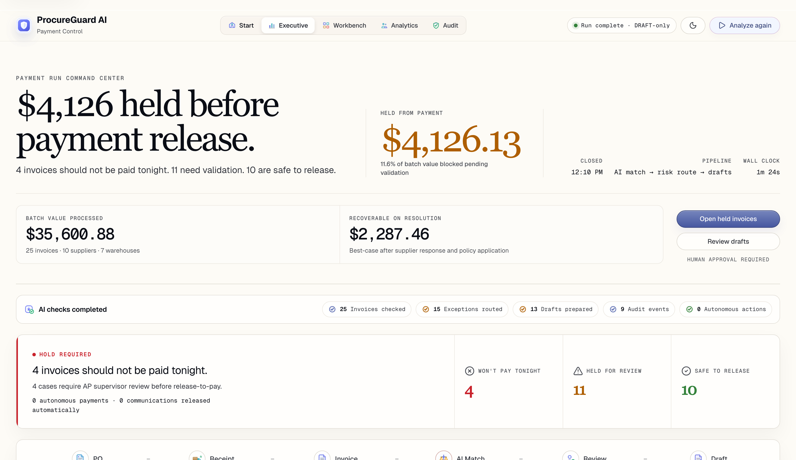
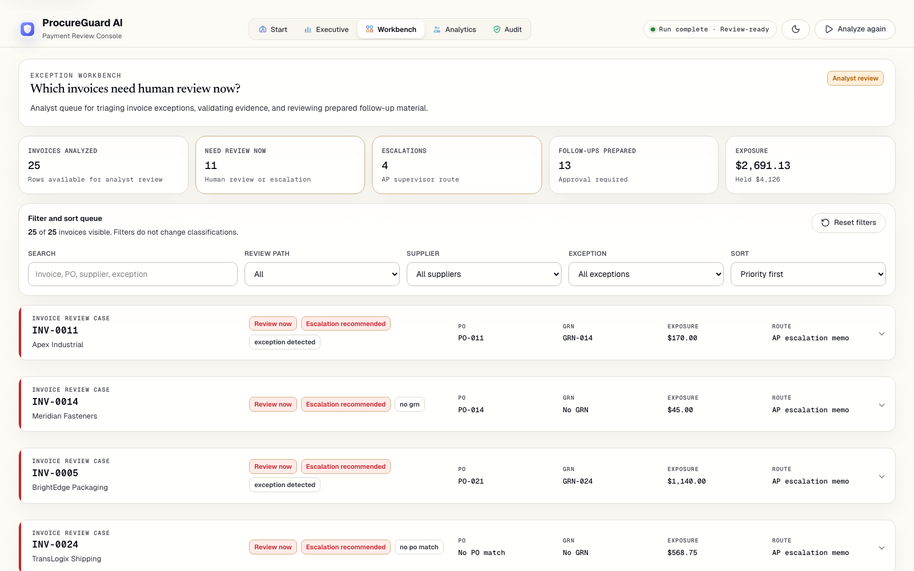
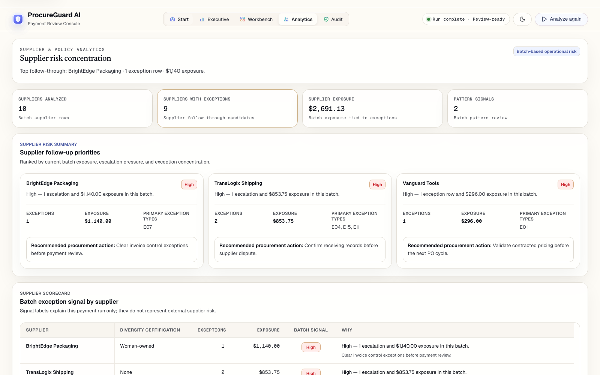
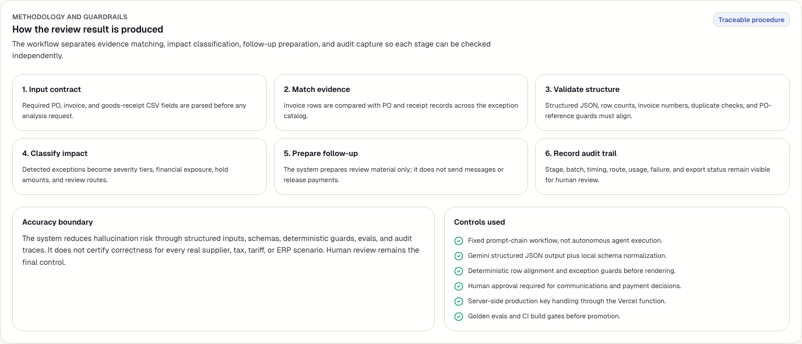
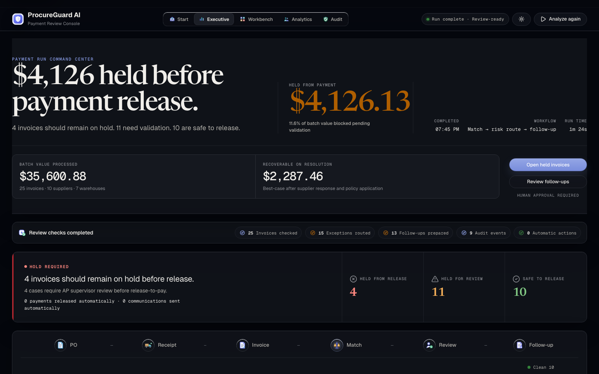

# ProcureGuard AI

A payment-run control desk for procurement teams. ProcureGuard compares purchase orders, supplier invoices, and goods receipts, identifies exceptions with evidence, and prepares review-ready follow-up work for human approval.

The system does not send emails, release payments, or execute supplier actions. Every AI decision is logged, prepared communications require human review, and nothing leaves the system without explicit human approval.



## The problem

Accounts payable teams manually compare invoices against purchase orders and goods receipts before every payment run. A mid-size company processes thousands of invoices per month, and each one needs to be checked for price variances, quantity mismatches, missing receipts, duplicate submissions, unauthorized charges, and timing discrepancies.

This manual review is slow, error-prone, and inconsistent. Missed exceptions lead to overpayments, duplicate payments, and compliance gaps. Caught exceptions still require follow-up — supplier emails, escalation memos, PO amendments — that take time to draft and track.

ProcureGuard automates the detection and evidence preparation so reviewers spend their time on judgment calls, not data comparison.

## How it works

ProcureGuard runs a three-stage Gemini analysis pipeline:

1. **Match** purchase orders, invoices, and goods receipts across 17 exception types.
2. **Classify** exceptions by severity tier and business impact.
3. **Prepare** supplier follow-ups, approval requests, and escalation notes for human review.

Each stage produces structured JSON validated against a schema. Results feed into five review surfaces.

## Methodology and trust model

ProcureGuard uses a fixed prompt-chain workflow, not an autonomous agent. The stages are intentionally separated so reviewers can trace source data -> matching evidence -> severity classification -> prepared follow-up -> audit record.

Accuracy is guarded by structured CSV inputs, Gemini structured JSON output, strict local schemas, row-count and invoice-alignment checks, deterministic exception guards, human-review-only actions, and a 25-case golden eval covering all 17 exception types. The system reduces hallucination risk but does not claim to eliminate it; outputs are review-supporting and require human validation before payment or supplier action.

See [docs/METHODOLOGY.md](docs/METHODOLOGY.md) for the pipeline design, prompt engineering approach, five-layer anti-hallucination architecture, evaluation methodology, and failure handling.

## What this demonstrates

- **AI product judgment:** the app augments procurement review instead of automating payment release or supplier outreach.
- **Reliability engineering:** model outputs are constrained with schemas, aligned to expected invoices, and checked by deterministic guards before rendering.
- **Risk management:** the design addresses hallucination, overreliance, excessive agency, secret exposure, and review traceability explicitly.
- **Evaluation discipline:** the repo includes a 25-case golden eval and CI gate rather than relying only on visual demos.
- **Deployment awareness:** production uses a Vercel serverless proxy so the Gemini key stays server-side.

See [docs/AI_ENGINEERING_BRIEF.md](docs/AI_ENGINEERING_BRIEF.md) for the reviewer-facing assumptions, principles, tradeoffs, expert-practice mapping, and suggested next improvements.

## Product walkthrough

| Executive Summary | Exception Workbench |
|---|---|
|  |  |

| Supplier Analytics | Audit and Governance |
|---|---|
|  |  |



## Architecture

```text
Procurement CSVs
      |
React browser app
      |
Gemini analysis pipeline (3 stages)
      |
Vercel serverless proxy
      |
Gemini 2.5 Flash
      |
Review dashboards
      |
Human approval only
```

| Layer | Choice | Why |
|---|---|---|
| **Frontend** | React 19, Vite 8, Tailwind CSS 4 | Component model fits five review surfaces. Vite gives instant HMR and production builds without SSR complexity — there's no database to render against. |
| **AI runtime** | Gemini 2.5 Flash | Structured JSON output enforced at the API level, not just prompting. Per-stage thinking budgets for controlled reasoning. Low cost per call for the portfolio scope. |
| **API proxy** | Vercel serverless function | Keeps the Gemini API key server-side in production. Zero-config deployment with automatic HTTPS. No backend framework needed for a single proxy route. |
| **Data** | Browser-only, session-scoped | No database by design. CSV parsing runs client-side, data clears on refresh. Avoids accidental retention of procurement data. |
| **Validation** | Deterministic eval harness | 25-invoice golden dataset with pure JavaScript exception detection — independent of the AI model. CI gate prevents regressions. |
| **No framework** | Direct Gemini API | The pipeline is three fixed calls. LangChain, vector search, and agent frameworks add abstraction without adding capability for this use case. |

## Repository layout

```text
procureguard-ai/
├── api/              Vercel serverless Gemini proxy
├── app/              React application
│   └── lib/          Gemini client, schemas, CSV parsing, pipeline, view models
├── data/             Sample CSVs and data dictionary
├── docs/             Engineering brief, methodology, decisions, requirements, handoff notes
├── evals/            Golden dataset and eval runner
├── prompts/          System prompts for the 3-stage pipeline
└── public/           App assets and live screenshots
```

## Run locally

```bash
npm install
npm run dev
```

Then open `http://127.0.0.1:5173/`, paste a Gemini API key into the session key field, upload the three CSVs from `data/`, and click Analyze.

## Deploy

See [DEPLOYMENT.md](DEPLOYMENT.md) for full instructions.

1. Connect the repository to Vercel.
2. Set `GEMINI_API_KEY` as an environment variable.
3. Run `node evals/run_evals.js` and `npm run build` before promotion.

## Verify

```bash
node evals/run_evals.js
npm run build
```

Expected eval result: 25/25 passed, 100%.

## Reference

- [docs/DECISIONS.md](docs/DECISIONS.md) — Architecture decision log
- [docs/AI_ENGINEERING_BRIEF.md](docs/AI_ENGINEERING_BRIEF.md) — Reviewer-facing AI engineering assumptions, principles, tradeoffs, and gaps
- [docs/METHODOLOGY.md](docs/METHODOLOGY.md) — AI engineering methodology, anti-hallucination architecture, and evaluation
- [docs/PRD.md](docs/PRD.md) — Product requirements
- [docs/HANDOFF.md](docs/HANDOFF.md) — Runtime snapshot and implementation notes
- [data/DATA_DICTIONARY.md](data/DATA_DICTIONARY.md) — Field definitions and exception catalog
- [DEPLOYMENT.md](DEPLOYMENT.md) — Deployment and production verification

## Development process

Built with AI-assisted engineering workflows including prompt design, structured output pipelines, deterministic evaluation, and iterative UI review. See [docs/METHODOLOGY.md](docs/METHODOLOGY.md) for the full engineering approach.

## License

[MIT](LICENSE)
