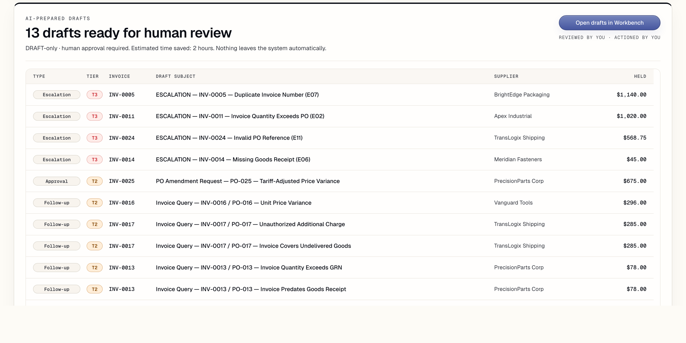

# ProcureGuard AI

ProcureGuard AI is a payment-run control desk for procurement teams. It compares purchase orders, supplier invoices, and goods receipts, identifies exceptions, explains the evidence, and prepares DRAFT-only follow-up work for human review.

The point of the product is not to automate payment release. The point is to give AP and procurement teams a clear answer before a payment run closes: what can be released, what should be held, what needs supplier validation, and what evidence supports that decision.



## What it does

ProcureGuard AI runs a structured three-stage analysis:

1. Match purchase orders, invoices, and goods receipts.
2. Classify exceptions by severity and business impact.
3. Prepare DRAFT-only supplier follow-ups, approval requests, and escalation notes.

The app keeps the human in control. Drafts are never sent automatically, payment decisions are not executed by the system, and the audit trail records the reasoning behind each stage.

## Product walkthrough

| Executive Summary | Exception Workbench |
|---|---|
|  |  |

| Supplier Analytics | Audit and Governance |
|---|---|
|  |  |

Dark mode is tuned separately for review work and public screenshots:


## Why it matters

Procurement exceptions are rarely isolated data problems. A single invoice can involve PO authorization, receipt timing, tax treatment, duplicate invoice risk, supplier master data, and policy ownership. ProcureGuard AI keeps those signals together in one review surface instead of scattering them across spreadsheets and email threads.

The current golden batch contains 25 invoices, 15 exception rows, 17 exception types, 13 prepared drafts, and 0 autonomous actions. Those counts come from the repository sample data and eval harness.

## Key surfaces

- **Start**: Upload the three CSV files and run the analysis with a session-only Gemini API key.
- **Executive Summary**: See the payment-run story first: held value, release decision, evidence, drafts, supplier risk, and audit replay.
- **Exception Workbench**: Review invoice-level evidence, exception classifications, exposure, draft text, and DRAFT-only controls.
- **Supplier and Policy Analytics**: Inspect supplier concentration, exception heatmaps, scorecards, and policy simulation signals.
- **Audit and Governance**: Review model routing, schema enforcement, token/cost telemetry, stage trace, and exportable audit metadata.

## Architecture

ProcureGuard AI is intentionally small:

- **Frontend**: React 19, Vite 8, Tailwind CSS 4, custom CSS design tokens.
- **AI runtime**: Gemini 2.5 Flash through a three-stage prompt chain.
- **Structured output**: JSON schema enforced per stage.
- **Data**: CSV parsing runs in the browser.
- **API**: Vercel serverless proxy for production Gemini calls.
- **Validation**: deterministic eval harness in `evals/run_evals.js`.
- **State**: session-local browser state. No database persistence.

The app does not use LangChain, vector search, autonomous agents, background email sending, or payment execution.

## End-to-end architecture

```text
Procurement CSVs
      ↓
React browser app
      ↓
Gemini analysis pipeline
      ↓
API proxy
      ↓
Gemini 2.5 Flash
      ↓
Review dashboards
      ↓
Human approval only

Golden eval suite → validates the pipeline
```

Operational boundaries:

- Local development can use a session-only browser key through the Vite proxy.
- Production uses `GEMINI_API_KEY` only on the serverless proxy.
- The AI path returns structured JSON; the UI renders decisions, evidence, drafts, and audit metadata from validated merged results.
- The product prepares review material only. It does not send supplier messages, release payment, or write to a database.

## Repository layout

```text
procureguard-ai/
├── api/                         # Vercel serverless Gemini proxy
├── app/                         # React application
│   └── lib/                     # Gemini client, schemas, CSV parsing, pipeline helpers, view models
├── data/                        # Sample purchase orders, invoices, goods receipts, and data dictionary
├── docs/                        # Handoff notes and staged implementation prompts
├── evals/                       # Golden dataset and deterministic eval runner
├── prompts/                     # Matching, classification, action generation, and extraction prompts
├── public/live-screenshots/     # Original live screenshots captured from the running app
├── .env.example                 # Required production environment variable names
├── DECISIONS.md                 # Architecture decision log
├── DEPLOYMENT.md                # Vercel deployment and production checks
├── PRD.md                       # Product requirements
├── index.html                   # Vite entry HTML and social metadata
├── package.json                 # npm scripts and dependencies
└── vite.config.js               # Vite config and local Gemini proxy
```

## Run locally

Install dependencies:

```bash
npm install
```

Start the Vite dev server:

```bash
npm run dev
```

Open the local app:

```text
http://127.0.0.1:5173/
```

Then:

1. Paste a Gemini API key into the **Session API key** field.
2. Upload `data/purchase_orders.csv`, `data/invoices.csv`, and `data/goods_receipts.csv`.
3. Click **Analyze**.
4. Review the Executive Summary, Workbench, Supplier Analytics, and Audit tabs.

For Vercel deployment, configure `GEMINI_API_KEY` as an environment variable. The production serverless function in `api/messages.js` reads that variable and only allows the approved Gemini model.

## Deploy

Deployment instructions are in [DEPLOYMENT.md](DEPLOYMENT.md).

The short version:

1. Connect the repository to Vercel.
2. Configure `GEMINI_API_KEY` in the Vercel environment.
3. Run `node evals/run_evals.js` and `npm run build` before promotion.
4. After deploy, run a full analysis with the sample CSVs and confirm every workspace tab populates.

## Verify

Run the deterministic eval suite:

```bash
node evals/run_evals.js
```

Build the app:

```bash
npm run build
```

Expected eval result for the current golden dataset:

```text
total_procurement_tests: 25
passed: 25
failed: 0
pass_rate: 100%
```

## Screenshot assets

The screenshots in `public/live-screenshots/` are original live captures from the running React app using the deterministic golden-batch demo seed. They are not static SVG mockups.

Recommended public assets:

- `procureguard-live-crop-drafts-killer-feature.png`: primary GitHub and LinkedIn hero image.
- `procureguard-live-executive.png`: full Executive Summary.
- `procureguard-live-workbench.png`: invoice review queue.
- `procureguard-live-analytics.png`: supplier and policy analytics.
- `procureguard-live-governance.png`: audit and governance.
- `procureguard-live-executive-dark.png`: dark-mode hero.

For README and LinkedIn posts, prefer the focused crops because they stay readable in compressed previews. Full-page captures remain available for deeper product documentation.

To reproduce deterministic screenshots during development:

```text
http://127.0.0.1:5173/?pgDemo=golden&pgTab=executive&pgTheme=light
http://127.0.0.1:5173/?pgDemo=golden&pgTab=workbench&pgTheme=light
http://127.0.0.1:5173/?pgDemo=golden&pgTab=analytics&pgTheme=light
http://127.0.0.1:5173/?pgDemo=golden&pgTab=governance&pgTheme=light
http://127.0.0.1:5173/?pgDemo=golden&pgTab=executive&pgTheme=dark
```

The demo seed is development-only and does not read or expose a real API key.

## Safety model

ProcureGuard AI is built around human-in-the-loop controls:

- No email is sent by the app.
- No supplier communication leaves the system automatically.
- No payment is released by the app.
- Drafts are labeled DRAFT-only.
- Audit entries preserve stage, prompt version, model routing, token usage, and run metadata.

This keeps the product credible for a demo while avoiding a false claim that the system autonomously executes procurement decisions.

## Reference

- [DECISIONS.md](DECISIONS.md): architecture decisions
- [DEPLOYMENT.md](DEPLOYMENT.md): deployment and production verification
- [data/DATA_DICTIONARY.md](data/DATA_DICTIONARY.md): field definitions and exception catalog
- [docs/HANDOFF.md](docs/HANDOFF.md): implementation history and validation notes
- [public/live-screenshots](public/live-screenshots): original live screenshot set
